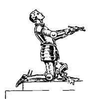
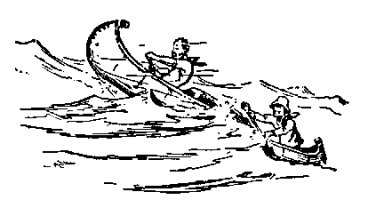
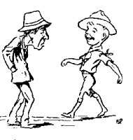

# I. Character

## Importance of Character

> A nation owes its success, not so much to its strength in armaments, as to the amount of character in its citizens.

"A nation owes its success, not so much to its strength in armaments, as to the amount of character in its citizens."

"For a man to be successful in life, character is more essential than erudition."

So character is of first value whether for a nation or for the individual. But if character is to make a man's career for him, it ought to be developed in him before he starts out; while he is still a boy and receptive. Character cannot be drilled into a boy. The germ of it is already in him, and needs to be drawn out and expanded. How?

Character is very generally the result of environment or surroundings. For exam- ple, take two small boys, twins if you like. Teach them the same lessons in school, but give them entirely different surroundings, companions, and homes outside the school. Put one under a kindly, encouraging mother, among clean and straight playfellows, where he is trusted on his honour to carry out rules of life and so on. On the other hand, take the second boy and let him loaf in a filthy home, among foul-mouthed, thieving, discontented companions. Is he likely to grow up with the same amount of character as his twin?

There are thousands of boys being wasted daily through being left to become characterless, and therefore, useless wasters, a misery to themselves and an eyesore and a danger to the nation.

They could be saved if only the right surroundings or environment were given to them at the receptive time of their lives. And there are many thousands of others who may not be placed on quite so low a level (for there are wasters in every class of life), but who would be all the better men and more valuable to the country and more satisfactory to themselves if they could be persuaded, at the right age, to develop their characters.

Here, then, lies the most important object in the Boy Scout training - to educate; not to instruct, mind you, but to educate, that is, to draw out the boy to learn for himself, of his own desire, the things that tend to build up character in him.

## One Reason Why a Troop Should not Exceed Thirty Two

The number in a Troop should preferably not exceed thirty-two. I suggest this number because in training boys myself I have found that sixteen was about as many as I could deal with - in getting at and bringing out the individual character in each. I allow for other people being twice as capable as myself and hence the total of thirty-two. Men talk of having fine Troops of 60 or even 100 - and their leaders tell me that their boys are equally well trained as in smaller Troops. I express admiration ("admiration" literally translated means "surprise"), and I don't believe them.

"Why worry about individual training?" they ask. Because it is the only way by which you can educate. You can instruct any number of boys, a thousand at a time if you have a loud voice and attractive methods of disciplinary means. But that is not training - it is not education.

Education is the thing that counts in building character and In making men.

The incentive to perfect himself, when properly instilled into the individual, brings about his active effort on the line most suitable to his temperament and powers.

It is not the slightest use to preach the Scout Law or to give it out as orders to a crowd of boys: each mind requires its special exposition of them and the ambition to carry them out.

That is where the personality and ability of the Scoutmaster come in.

So, let us consider a few of the qualities, moral and mental that go to make **Character**, and then see how the Scoutmaster can get the boy to develop these for himself through Scouting.

## Chivalry and Fair Play

The code of the medieval knights has been the foundation for the conduct of gen- tlemen ever since the day around A.D. 500, when King Arthur made the rules for his Knights of the Round Table. The romance of the Knights has its attraction for all boys and has its appeal to their moral sense. Their Code of Chivalry included Honour, Self-Discipline, Courtesy, Courage, Selfless Sense of Duty and Service, and the guidance of Religion.

The rules as they were republished in the time of Henry VII are as follow:-

1. They were never to put off their armour, except for the purpose of rest at night.
2. They were to search for adventures wherein to attain "bruyt and renown."
3. To defend the poor and weak.
4. To give help to any who should ask it in a just quarrel.
5. Not to offend one another.
6. To fight for the defence and welfare of their country.
7. To work for honour rather than profit.
8. Never to break a promise for any reason whatever.
9. To sacrifice themselves for the honour of their country.
10. "Sooner choose to die honestly than to flee shamefully."

The ideals of the Knights and the idea of fair play is above all the one which can be best instilled into boys and leads them to that strong view of justice which should be part of their character, if they are going to make really good citizens.

This habit of seeing things from the other fellow's point of view can be developed in outdoor games where fair play is essential, whether it is in "Flag Raiding" or "Dispatch Running." During the game the strictest rules are observed which mean self-restraint and good temper on the part of the players, and at the end it is the proper form that the victor should sympathise with the one who is conquered, and that the opponent should be the first to cheer and congratulate the winner.

This should be made the practice until it becomes the habit. A further valuable aid to the training in fairness is the holding of debates amongst the boys on subjects that interest them and which lend themselves to argument on both sides. This is to get them into the way of recognizing that every important question has two sides to it, and that they should not be carried away by the eloquence of one orator before they have heard what the defender of the other side has to say on the subject, and that they should then weigh the evidence of both sides for themselves before making up their mind which part they should take.

A practical step in ensuring this is not to vote by show of hands, where the hesitating or inattentive boy votes according to the majority. Each should record his vote "ay" or "no" on a slip of paper and hand it in. This ensures his making up his mind for himself after duly weighing both sides of the question.

In the same, way mock trials or arbitration of quarrels, if carried out seriously and on the lines of a law court, are of the greatest value in teaching the boys the same idea of justice and fair play, and also give them a minor experience of what their civic duties may be as jurymen or witnesses later on. The Court of Honour in the Troop is another step in the same direction, and as the boys here have a real responsibility by being members of the Court, the seriousness of their views is brought home to them a11 the more, and encourages them to think out carefully the right line to take when they have heard all the arguments on both sides.

Thus a Scoutmaster, who uses his ingenuity towards the end of teaching fair play, unselfishness and sense of duty to others, may make ample opportunities, whether indoors or out, for training his Scouts. Of all the subjects with which we are dealing, I believe this to be one of the most important towards self-governing citizenship, though I fear I have only touched upon it in a very sketchy manner.

## Discipline

A nation to be prosperous must be well disciplined, and you only get discipline in the mass by discipline in the individual. By discipline I mean obedience to authority and to other dictates of duty. This cannot be got by repressive measures, but by encouragement and by educating the boy first in self-discipline and in sacrificing of self and selfish pleasures for the benefit of others. This teaching is largely effective by means of example, by putting responsibility upon him and by expecting a high standard of trustworthiness from him.

Responsibility is largely given through the Patrol System by holding the Leader responsible for what goes on amongst his boys.

Sir Henry Knyvett, in 1596, warned Queen Elizabeth that the State which neglects to train and discipline its youth produces not merely rotten soldiers or sailors, but the far greater evil of equally rotten citizens for civil life; or, as he words it, "For want of true discipline the hour and wealth both of Prince and countrie is desperatlie and frivouslie ruinated."

Discipline is not gained by punishing a child for a bad habit, but by substituting a better occupation, that will absorb his attention, and gradually lead him to forget and abandon the old one.

The Scoutmaster should insist on discipline, and strict, quick obedience in small details. Let the boys run riot only when you give leave for it - which is a good thing to do every now and then.

## Sense of Honour

The **Scout Law** is the foundation on which the whole of Scout training rests. Its various clauses must be fully explained and made clear to the boys by practical and simple illustrations of its application in their everyday life.

There is no teaching to compare with example. If the Scoutmaster himself conspicuously carries out the Scout Law in all his doings, the boys will be quick to follow his lead.

This example comes with all the more force if the Scoutmaster himself takes the Scout Promise, in the same way as his Scouts.

The first Law, namely, A Scout's honour is to be trusted (A Scout is Trustworthy), is one on which the whole of the Scout's future behaviour and discipline hangs. The Scout is expected to be straight. So it should be very carefully explained, as a first step, by the Scoutmaster to his boys before taking the Scout Promise.

The investiture of the Scout is purposely made into something of a ceremony, since a little ritual of that kind if carried out with strict solemnity, impresses the boy; and considering the grave importance of the occasion, it is only right that he should be impressed as much as possible. Then it is of great importance that the Scout should periodically renew his knowledge of the Law. Boys are apt to be forgetful, and it should never be allowed that a boy who has made his solemn promise to carry out the Scout Law should, at any time, not be able to say what the Law is.

Once the Scout understands what his honour is and has, by his initiation, been put upon his honour, the Scoutmaster must entirely trust him to do things. You must show him by Your action that you consider him a responsible being. Give him charge of something, whether temporary or permanent, and expect him to carry out his charge faithfully. Don't keep prying to see how he does it. Let him do it his own way, let him come a howler over it if need be, but in any case leave him alone and trust him to do his best. Trust should be the basis of all our moral training.

Giving responsibility is the key to success with boys, especially with the rowdiest and most difficult boys.

The object of the Patrol System is mainly to give real responsibility to as many of the boys as possible with a view to developing their character. If the Scoutmaster gives his Patrol Leader real power, expects a great deal from him, and leaves him a free hand in carrying out his work, he will have done more for that boy's character expansion than any amount of school-training could ever do.

## Self-Reliance

A boy does not really get the full value of Scout training until he is a First Class Scout. The tests for First Class Scouts were laid down with the idea that a boy, who proved himself equipped to that extent, might reasonably be considered as grounded in the qualities which go to make a good, manly citizen.

As the boy becomes conscious of no longer being a Tenderfoot, but of being a responsible and trusted individual with power to do things, he becomes self-reliant. Hope and ambition begin to dawn for him.

He could not but feel himself a more capable fellow than before, and therefore, he should have that confidence in himself which will give him the hope and pluck in time of stress in the struggle of life, which will encourage him to stick it out till he achieves success.

First aid or firemanship, or trek cart or bridge building are of value for handiness and use of wits, since the boy, while working in co-operation with the others, is responsible for his own separate part of the job.

Swimming has its educational value - mental, moral, and physical - in giving you a sense of mastery over an element, and of power of saving life, and in the development of wind and limb. When training the South African Constabulary I used to send the men out in pairs to carry out long distance rides of two or three hundred miles to teach them to fend for themselves and to use their intelligence.

But when I had a somewhat dense pupil he was sent out alone, without another to lean upon, to find his own way, make his own arrangements for feeding himself and his horse, and for drawing up the report of his expedition unaided. This was the best training of all in self-reliance and intelligence, and this principle is one which I can confidently recommend to Scoutmasters in training their Scouts.

Of all the schools the camp is far and away the best for teaching boys the desired characterattributes. The environment is healthy, the boys are elated and keen, all the interests of life are round them, and the Scoutmaster has them permanently for the time, day and night, under his hand. In camp the Scoutmaster has his greatest opportunity for watching and getting to know the individual characteristics of each of his boys, and then apply the necessary direction to their development; while the boys themselves pick up the character-forming qualities incident to life in camp, where discipline, resourcefulness, ingenuity, self-reliance, handcraft, wood-craft, boat-craft, team sense, nature lore, etc., can all be imbibed under cheery and sympathetic direction of the understanding Scoutmaster. A week of this life is worth six months of theoretical teaching in the meeting room, valuable though that may be.

Therefore, it is most advisable that Scoutmasters who have not had much experience in that line should study the subject of the camp in its various bearings.

## Enjoyment of Life

Why is Nature Lore considered a Key Activity in Scouting? That is a question on which hangs the difference between Scout work and that of the ordinary boys' club. It is easily answered in the phrase: "We want to teach our boys not merely how to get a living, but how to live" - that is, in the higher sense, how to enjoy life. Nature lore, as I have probably insisted only too often, gives the best means of opening out the minds and thoughts of boys, and at the same time, if the point is not lost sight of by their Scoutmaster, it gives them the power of appreciating beauty in nature, and consequently in art, such as leads them to a higher enjoyment of life. This is in addition to the realisation of God the Creator through His wondrous work, which when coupled with active performance of His will in service for others constitutes the concrete foundation of religion.

Some years ago I was in the sitting-room of a friend who had just died, and lying on the table beside his abandoned pipe and tobacco pouch was a book by Richard Jefferies-Field and Hedgerow, in which a page was turned down which said:-

> The conception of moral good is not altogether satisfying. The highest form known to us at present is pure unselfishness, the doing of good not for any reward now or hereafter, nor for the completion of any imaginary scheme. That is the best we know, but how unsatisfactory! An outlet is needed more fully satisfying to the heart's inmost desire than is afforded by any labour of selfabnegation. It must be something in accord with the perception of beauty and of an ideal. Personal virtue is not enough. Though I cannot name the ideal good it seems to me that it will in some way be closely associated with the ideal beauty of Nature.

In other words, one may suggest that happiness is a matter of inner conscience and outward sense working in combination. It is to be got where the conscience as well as the senses together are satisfied. If the above quoted definition be true, the converse is at least equally certain - namely, that the appreciation of beauty cannot bring happiness if your conscience is not at rest. So that if we want our boys to gain happiness in life we must put into them the practice of doing good to their neighbours, and in addition, the appreciation of the beautiful in Nature.

The shortest step to this last is through Nature lore:- ... books in the running brooks, Sermons in stones, and good in everything.

Among the mass of boys their eyes have never been opened, and to the Scoutmaster is given the joy of bringing about this worth-while operation.

Once the germ of woodcraft has entered into the mind of a boy, observation, memory and deduction develop automatically and become part of his character. They remain whatever other pursuits he may afterwards take up.

As the wonders of nature are unfolded to the young mind, so too its beauties can be pointed out and gradually become recognised. When appreciation of beauty is once given a place in the mind, it grows automatically in the same way as observation, and brings joy in the greyest of surroundings.

If I may diverge again, it was a dark, raw, foggy day in the big gloomful station at Birmingham. We were hustled along in a throng of grimy workers and muddy travel-stained soldiers. Yet, as we pushed through the crowd, I started and looked around, went on, looked round again, and finally had a good eyefilling stare before I went on. I don't suppose my companions had realised it, but I had caught a gleam of sunshine in that murky hole such as gave a new pleasure to the day. It was just a nurse in brown uniform with gorgeous red-gold hair and a big bunch of yellow and brown chrysanthemums in her arms. Nothing very wonderful you say. No, but for those who have eyes to see, these gleams are there even in the worst of gloom.

It is too common an idea that boys are unable to appreciate beauty and poetry; but I remember once some boys were being shown a picture of a stormy landscape, of which Ruskin had written that there was only one sign of peace in the whole wind-torn scene. One of the lads readily pointed to a spot of blue peaceful sky that was apparent through a rift in the driving wrack of clouds.

Poetry also appeals in a way that it is difficult to account for, and when the beautiful begins to catch hold, the young mind seems to yearn to express itself in something other than everyday prose.

Some of the best poetry can of course be found in prose writing, but it is more generally associated with rhythm and rhyme. Rhyme, however, is apt to become the great effort with the aspiring young poet, and so you get the most awful doggerel thrust upon you in your efforts to encourage poetry.

Switch them off doggerel if you can. It is far too prevalent.

## Development of Outlook: Reverence

Development of outlook naturally begins with a respect for God, which we may best term "Reverence."

Reverence to God and reverence for one's neighbour and reverence for oneself as a servant of God, is the basis of every form of religion. The method of expression of reverence to God varies with every sect and denomination. What sect or de- nomination a boy belongs to depends, as a rule, on his parents' wishes. It is they who decide. It is our business to respect their wishes and to second their efforts to inculcate reverence, whatever form of religion the boy professes.

There may be many difficulties relating to the definition of the religious training in our Movement where so many different denominations exist, and the details of the expression of duty to God have, therefore, to be left largely in the hands of the local authority. But there is no difficulty at all in suggesting the line to take on the human side, since direct duty to one's neighbour is implied in almost every form of belief.

The following is the attitude of the Scout Movement as regards religion, approved by the heads of all the different denominations on our Council:-

(a) It is expected that every Scout shall belong to some religious denomination, and attend its services.
(b) Where a Troop is composed of members of one particular form of religion, it is hoped that the Scoutmaster will arrange such denomi- national religious observances and instruction as he, in consultation with its Chaplain or other religious authority, may consider best.
(c) Where a Troop consists of Scouts of various religions they should be encouraged to attend the service of their own denomination, and in camp, any form of daily prayer and of weekly Divine service should be of the simplest character, attendance being voluntary.

If the Scoutmaster takes this pronouncement as his guide he cannot go far wrong.

I am perfectly convinced that there are more ways than one by which reverence may be inculcated. The solution depends on the individual character and circum- stances of the boy, whether he is a "hooligan" or a "mother's darling." The training that may suit the one may not have much effect on the other. It is for the teacher, whether Scoutmaster or Chaplain, to select the right training.

Religion can only be "caught," not "taught." It is not a dressing donned from outside, put on for Sunday wear. It is a true part of a boy's character, a development of soul, and not a veneer that may peel off. It is a matter of personality, of inner conviction, not of instruction.

Speaking from a fairly wide personal experience, having had some thousands of young men through my hands, I have reached the conclusion that the actions of a very large proportion of our men are, at present, very little guided by religious conviction.

This may be attributed to a great extent to the fact that often instruction instead of education has been employed in the religious training of the boy.

The consequence has been that the best boys in the Bibleclass or Sunday School have grasped the idea, but in many cases they have, by perfection in the letter, missed the spirit of the teaching and have become zealots with a restricted outlook, while the majority have never really been enthused, and have, as soon as they have left the class or school, lapsed into indifference and irreligion, and there has been no hand to retain them at the critical time of their lives, i.e., sixteen to twenty-four.

It is not given to every man to be a good teacher of religion, and often the most earnest are the greatest failures - and without knowing it.

We have, fortunately, a number of exceptionally well-qualified men in this respect among our Scoutmasters, but there must also be a number who are doubtful as to their powers, and where a man feels this, he does well to get a Chaplain, or other experienced teacher, for his Troop.

On the practical side, however, the Scoutmaster can in every case do an immense amount towards helping the religious teacher, just as he can help the schoolmaster by inculcating in his boys, in camp and club, the practical application of what they have been learning in theory in the school.

In denominational Troops there is, as a rule, a Troop Chaplain, and the Scout- master should consult with him on all questions of religious instruction. For the purpose of its religious training, a service or class can be held, called a "Scouts' Own." This is a gathering of Scouts for the worship of God and to promote fuller realisation of the Scout Law and Promise, but supplementary to, and not in sub- stitution for, regular religious observances.

Many of our Troops, however, are interdenominational, having boys of different forms of belief in their ranks. Here the boys should be sent to their own clergy and pastors for denominational religious instruction.

Other Troops in slums and less-chance areas have lads of practically no religion of any kind, and their parents are little or no help to them. Naturally, these require different handling and methods of training from those boys in whom religion has been well grounded.

Here, again, Scouting comes very practically to the aid of the teacher, and has already given extraordinarily good results.

The way in which Scouting can help is through the following:-

(a) Personal example of the Scoutmaster.

(b) Nature study.

(c) Good Turns.

(d) Retention of the older boy.

**(a) Personal Example** - There is no doubt whatever that in the boys' eyes it is what a man does that counts and not so much what he says. A Scoutmaster has, therefore, the greatest responsibility on his shoulders for doing the right thing from the right motives, and for letting it be seen that he does so, but without making a parade of it. Here the attitude of elder brother rather than of teacher tells with the greater force.

**(b) Nature Study** - There are sermons in the observation of Nature, say, in bird life, the formation of every feather identical with that of the same species 10,000 miles away, the migration, the nesting, the colouring of the egg, the growth of the young, the mothering, the feeding, the flying power-all done without the aid of man, but under the law of the Creator; these are the best of sermons for boys.

The flowers in their orders, and plants of every kind, their buds and bark, the animals and their habits and species; then the stars in the heavens, with their appointed places and ordered moves in space, give to every one the first conception of Infinity and of the vast scheme of his Creator where man is of so small account. All these have a fascination for boys, which appeals in an absorbing degree to their inquisitiveness and powers of observation, and leads them directly to recognise the hand of God in this world of wonders, if only some one introduces them to it.

The wonder to me of all wonders is how some teachers have neglected this easy and unfailing means of education and have struggled to impose Biblical instruction as the first step towards getting a restless, full-spirited boy to think of higher things.

**(c) Good Turns** - With a little encouragement on the part of the Scoutmaster the practice of daily Good Turns soon becomes a sort of fashion with boys, and it is the very best step towards making a Christian in fact, and not merely in theory. The boy has a natural instinct for good if he only sees a practical way to exercise it, and this Good Turn business meets it and develops it, and in developing it brings out the spirit of Christian charity towards his neighbour.

This expression of his will to good, is more effective, more natural to the boy, and more in accordance with the Scout method than his passive acceptance of instructive precepts.

**(d) Retention of the Older Boy** - So soon as the ordinary boy begins to get a scholastic knowledge of reading, writing, and arithmetic, he is sent out into the world, as fit and equipped for making his career as a good working citizen. After leaving school, excellent technical schools are generally open to the boy, as well as continuation classes, if he likes to go to them, or if his parents insist on his attending after his day's work is over. The best boys go, and get a good final polish.

But what about the average and the bad? They are allowed to slide away-just at the one period of their life when they most of all need continuation and completion of what they have been learning, just at the time of their physical, mental and moral change into what they are going to be for the rest of their lives.

This is where the Scout Movement can do so much for the lad, and it is for this important work that we are doing all we can to organise the Senior Scouts in order to retain the boy, to keep in touch with him, and to inspire him with the best ideals at this, his crossroads for good or evil.

## Self-Respect

In speaking of the forms of reverence which the boy should be encouraged to develop, we must not omit the important one of reverence for himself, that is self-respect in its highest form.

This, again, can well be inculcated through nature study as a preliminary step. The anatomy of plants, or birds, or shell-fish may be studied and shown to be the wonderful work of the Creator. Then the boy's own anatomy can be studied in a similar light; the skeleton and the flesh, muscle, nerves, and sinews built upon it, the blood flow and the breathing, the brain and control of action, all repeated, down to the smallest details, in millions of human beings, yet no two are exactly alike in face or finger prints. Raise the boy's idea of the wonderful body which is given to him to keep and develop as God's own handiwork and temple; one which is physically capable of good work and brave deeds if guided by sense of duty and chivalry, that is by a high moral tone.

Thus is engendered self-respect.

This, of course, must not be preached to a lad in so many words and then left to fructify, but should be inferred and expected in all one's dealings with him. Especially it can be promoted by giving the boy responsibility, and by trusting him as an honourable being to carry out his duty to the best of his ability, and by treating him with respect and consideration, without spoiling him.
