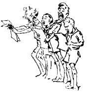
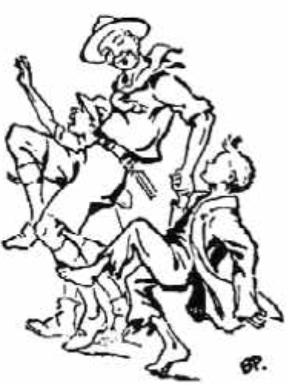

# III. Handicraft and Skill

There is today, as there has always been, a fearful waste of human material. This is. mainly due to ineffective training. The general mass of boys are not taught to like work. Even when they are taught handicrafts or business qualities, they are seldom shown how to apply these to making a career, nor is the flame of ambition kindled in them. Square pegs are too often placed in round holes.

Exactly where the fault lies one cannot say, but the fact remains that it is so.

Consequently, those boys who have not got these gifts naturally are allowed to drift and to become wasters. They are a misery to themselves and a burden even in some cases, a danger to the State. And the large proportion of those who do make some sort of a success would undoubtedly do better were they trained in a more practical way.

In the Boy Scouts we can do something to remedy these evils. We can take some steps towards giving even the poorest boy a start and a chance in life equipped, at any rate, with hope and a handicraft.

How? Naturally one's thoughts run to handcraft Badges. Though we call these "Handicrafts," they are, with our standard of tests, little more than "Hobbies." This, however, is part of our policy of leading the boys on with small and easy beginnings; and these Hobbies become more specialised as vocational training for the Senior Scouts. In the meantime, hobbies have their value; through these the boy learns to use his fingers and his brain, and to take a pleasure in work. For one boy these may remain his hobbies for years; for another they may lead to craftsmanship which will give him a career. In either case, the boy is not so likely to become a waster later on. Hobbies are an antidote to Satan's little games.

But hobbies or handicrafts are not likely to make a career for a boy without the help of certain moral qualities. Thus, the craftsman must have self-discipline. He must adapt himself to the requirements of his employer and of his fellow-workers, he must keep himself sober, and efficient, and willing.

He must have energy, and that depends on the amount he has of ambition, of skill, of resourcefulness, and of good health.

Now, how do we apply these in the Boy Scout's training?

## Pioneering as a First Step

The first step towards getting a Scout to take up handiwork is most easily effected in camp, in the practice of hut-building, tree-felling, bridge-building, improvising camp utensils, such as pot-hooks and plate-racks, etc., tent-making, mat-weaving with the camp-loom, and so on. The boys find these tasks to be practical and useful to their comfort in the camping season.

After making a start on these, they will be the more keen to go in for such hobbies in the winter evenings, as will bring them Badges in return for proficiency, and money in return for skillful work. In that way they soon grow into ardent, energetic workers.

## Proficiency Badges (Merit Badges)

Proficiency Badges are established with a view to developing in each lad the taste for hobbies or handicrafts, one of which may ultimately give him a career and not leave him hopeless and helpless on going out into the world.

The Badges are merely intended as an encouragement to a boy to take up a hobby or occupation and to make some sort of progress in it; they are a sign to an outsider that he has done so; they are, not intended to signify that he is a master in the craft he is tested in. If once we make Scouting into a formal scheme of serious instruction in efficiency, we miss the whole point and value of Scout training, and we trench on the work of the schools without the trained experts for carrying it out. We want to get all our boys along through cheery self-development from within and not through the imposition of formal instruction from without.

But the object of the Badge System in Scouting is also to give the Scoutmaster an instrument by which he can stimulate keenness on the part of every and any boy to take up hobbies that can be helpful in forming his character or developing his skill.

It is an instrument which - if applied with understanding and sympathy - is designed to give hope and ambition even to the dullest and most backward, who would otherwise be quickly outdistanced and so rendered hopeless in the race of life. It is for this reason that the standard of proficiency is purposely left undefined. Our standard for Badge earning is not the attainment of a certain level of quality of knowledge or skill, but the **amount of effort the boy has put into acquiting such knowledge or skill**. This brings the most hopeless case on to a footing of equal possibility with his more brilliant or better-off brother.

An understanding Scoutmaster who has made a study of his boys' psychology can thus give to the boy an encouraging handicap, such as will give the dull boy a fair start alongside his betterbrained brother. And the backward boy, in whom the inferiority complex has been born through many failures, can have his first win or two made easy for him so that he is led to intensify his efforts. If he is a trier, no matter how clumsy, his examiner can accord him his Badge, and this generally inspires the boy to go on trying till he wins further Badges and becomes normally capable.

The examination for Badges is not competitive, but just a test for the individual. The Scoutmaster and the examiner must therefore work in close harmony, judging each individual case on its merits, and discriminating where to be generous and where to tighten up.

Some are inclined to insist that their Scouts should be firstrate before they can get a Badge. That is very right, in theory; you get a few boys pretty proficient in this way - but our object is to get all the boys interested. The Scoutmaster who puts his boys at an easy fence to begin with will find them jumping with confidence and keenness, whereas if he gives them an upstanding stone wall to begin, it makes them strong.

At the same time, we do not recommend the other extreme, namely, that of almost giving away the Badges on very slight knowledge of the subjects. It is a matter where examiners should use their sense and discretion, keeping the main aim in view.

There is always the danger of Badge-hunting supplanting Badge-earning. Our aim is to make boys into smiling, sensible, self-effacing, hardworking citizens, instead of showy, self-indulgent boys. The Scoutmaster must be on the alert to check Badge- hunting and to realise which is the Badge-hunter and which is the keen and earnest worker.

Thus the success of the Badge System depends very largely on the Scoutmaster himself and his individual handling of it.

## Intelligence

Observation and deduction are the basis of all knowledge. The importance of the power of observation and deduction to the young citizen can therefore not be over- estimated. Children are proverbially quick in observation, but it dies out as they grow older, largely because first experiences catch their attention, which they fail to do on repetition.

Observation is, in fact, a habit to which a boy has to be trained. Tracking is an interesting step towards gaining it. Deduction is the art of subsequently reasoning out and extracting the meaning from the points observed.

When once observation and deduction have been made habitual in the boy, a great step in the development of character has been gained.

The value of tracking and tracking games can thus readily be seen. Tracking out-of-doors and lectures on tracks and tracking in the meeting room should be encouraged in all Scout Troops.

The general intelligence and quick-wittedness of the boys can very considerably be educated by their finding the way with a map, noticing landmarks, estimating heights and distances, noticing and reporting details of people, vehicles, cattle, by the reproduction of Sherlock Holmes stories in scenes, and through numerous other Scout practices. Signalling sharpens their wits, develops their eyesight, and encourages them to study and to concentrate their minds. First aid instruction has also similar educative value.

Winter evenings and wet days can be usefully employed by the Scoutmaster reading the principal items of news in the day's newspaper, illustrating them by map, etc. The getting-up of plays and pageants bearing on the history of the place is also an excellent means of getting the boys to study, and to express themselves without self-consciousness.

## Self-Expression

Our Art Badge is devised to lead boys on to express their ideas graphically from their own observation or imagination without attempting thereby to be or to imitate artists. By encouraging drawing, however crude, on the part of the youngster, he can be led on to recognise beauty in color or in form, to realise that even in sordid surroundings there may yet be light and shadow, color and beauty.

A further stage in his education can be brought about by getting him to practice mental photography, that is to notice the details of a scene or incident or person, and fix these in his mind, and then to go and reproduce them on paper.

This teaches observation in the highest degree. Personally I have found by prac- tice that one can develop a certain and considerable power in this direction.

Rhythm is a form of art which comes naturally even to the untrained mind, whether it be employed in poetry or music or in body exercises. It gives a balance and order which has its natural appeal even and especially among those closest to nature-savages. In the form of music it is of course most obvious and universal. The Zulu War Song when sung by four or five thousand warriors is an example of rhythm, in music, poetry and bodily movement combined.

The enjoyment of rendering music is common to all the human family, The song as a setting to words enables the soul to give itself expression which, when adequately done, brings pleasure both to the singer and to his hearer.

Through his natural love of music the boy can be linked up with poetry and sentiment as by a natural and easy transition. It opens a ready means to the Scoutmaster of teaching happiness to his lads and at the same time of raising the tone of their thoughts.

Play-acting also ought to form part of every boy's education for self-expression.

At school I was encouraged to do a lot of play-acting and I have thanked my stars ever since that I did so. For one thing it taught me to learn yards of stuff by heart; also accustomed me to speak clearly and without nervousness before a lot of people; and it gave me the novel joy of being someone else for a time.

It led one to know the beauties of Shakespeare and other authors, to feel, while expressing them, the emotions of joy and sorrow, love and sympathy.

Above all it gave one the pleasure and happiness of giving pleasure to other people at times when they needed it.

Many troops are giving entertainments in the winter months and are thus not only earning satisfactory additions to their funds, but are giving good training to their boys and pleasure to others.

## From Hobby to Career

Hobbies, handcraft, intelligence and health are preliminary steps for developing love of work and ability to carry on, which are essential to successful work. The second stage is fitting the young worker to the right kind of work.

The best workers, like the happiest livers, look upon their work as a kind of game: the harder they play the more enjoyable it becomes. H. G. Wells has said:-

> I have noticed that so called great men are really boys at heart, that is, they are boys in the eagerness of their enjoyment of their task. They work because they like to work, and thus their work is really play to them. The boy is not only father to the man, but he is the man and does not disappear at all.

Ralph Parlette says truly:-

> Play is Loving to do things, and Work is Having to do things.

In Scouting we try to help the boys acquire this attitude, by making them person- ally enthused in subjects that appeal to them individually, and that will be helpful to them later on.

We do this first and foremost through the fun and jollity of Scouting. The boys can then by progressive stages be led on naturally and unconsciously to develop themselves for their future.

## The Scoutmaster's Share

So much for the lines on which a boy can be practically prepared through Scouting for making a career.

But this only prepares him. It is still in the power of his Scoutmaster to give him further help to making that career a successful one.

First, by showing the lad ways by which he can perfect the superficial instruc- tion received as a Scout; whereby, for instance, he can develop his hobbies into handicrafts. The Scoutmaster can show him where to get higher technical educa- tion, how to get scholarships or apprenticeships, how to train himself for particular professions, how to invest his savings, how to apply for jobs, and so on.

Secondly, by himself knowing the different kinds of employment agencies and how to use them, the terms of service in various professions, the Scoutmaster can give the lad invaluable help, by advising him, on his knowledge of his qualifications, as to which line of life he is best fitted for. All this means that the Scoutmaster must himself look around and inform himself fully on these and like points. By taking a little trouble himself he can make successful lives for many of his boys.

It is encouraging to a lad, even if he is only an errand boy, to know that if he does his errands so well that his employer feels he could not get a better boy, he is safely on the road to promotion. But he must stick to it, and not be led aside by fits of disinclination or annoyance; if he gives way to these he will never succeed. Patience and perseverance win the day. "Softly, softly, catchee monkey."

## Employment

The Scoutmaster, by watching and studying the individual character and ability of each boy, can to some extent recognise the line of life for which he is best fitted.

But he should realise that the question of employment is one for the parents and the boy himself to decide.

It is then a matter of consultation with the parents, and for cautioning them against putting their square peg of a son into a round hole of employment for the sake of immediate monetary return. Get them and the boy himself to look well ahead and to see ulterior possibilities that lie open to him, provided that his start is made on the right lines.

Here it is important to discriminate between those employments which offer a future to the boy and those which lead to nothing - so-called "blind alley" jobs. These latter often bring in good money for the time being, to increase the weekly in- come of the family, and are, therefore, adopted for the boy by the parents regardless of the fact that they give no opening to him for a man's career afterwards.

Those which promise a future need careful selection with regard to the lad's capabilities, and they can be prepared for, while he is yet a Scout. A skilled employment is essentially better than an unskilled one for the boy's future success in life. But care should be taken that consideration of this question is not left until the time is past for a boy to conform to the standards and rules for entering into the desired career.
