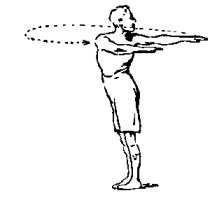
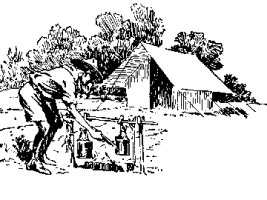

# II. Health and Strength

## Importance of Health

The value of good health and strength in the making of a career and in the enjoyment of life is incalculable. That is pretty obvious. As a matter of education one may take it to be of greater value than "book-learning" and almost as valuable as "Character."

We in the Scout Movement can do much by giving to the boys some of the training in health and personal hygiene which is so essential to their efficiency as citizens.

Our task should be to get the boys to be athletic-minded, at the same time showing them that they must first build up their bodily health before they can safely take up strenuous physical exercises. This would be by proper plain feeding, and hygienic care of themselves in the matter of cleanliness, nose breathing, rest, clothing, regular habits, continence, and so on. We must avoid making them in- trospective by thinking of themselves liable to illness, etc., but hold up fitness for sport as the aim of health training.

With only half an hour per week in the ordinary Scout Troop meeting it is not possible for us to give formal physical training, but what we can do is to teach the boy to be personally responsible to himself for his health - how to secure it and keep it; also we can teach him a few exercises that will help him to develop his strength if he will practise them in his own time; and we can interest him in outdoor activities and games as being not only amusement for him but of practical value in making him sound, strong and healthy for life. Health of body involves health of nerves and health of mind.

Here our character training meets the physical.

## Be Fit!

Studies have shown that there is an immense percentage of unfit men among our citizens who, with reasonable care and understanding, could have been healthy efficient beings. Some of the reports on the health of school children show that one in every five suffers from defects that will prevent him from being efficient in after-life defects, mind you, which might have been prevented.

These returns are immensely suggestive, and point at once to the need and the remedy; if we took the boy in time, tens of thousands could be saved every year to become strong and capable citizens instead of dragging out a miserable semi-efficient existence.

It is a matter of national as well as individual importance.

There is much talk of developing the physical training of the rising generation on a much more general basis, and in this direction lies a tremendous opening for our work. But I want to warn Scoutmasters against being led by this cry on to the wrong tack.

You know from our chart on page 23 how and why Character and Physical Health are two of our main objects in Scouting, and also the steps by which we endeavour to gain them.

But bear in mind physical health is not necessarily the result of physical drill.

The physical training given in the Army has been carefully thought out, and is excellent for its purpose. It is suited to the more formed muscular system of the man, and soldiers improve tremendously under this intensive form of training.

But it is often artificial, designed to make up for what has not been naturally acquired.

God didn't invent physical "jerks," The Zulu warrior, splendid specimen though he is, never went through Swedish drill. Even the ordinary boy, who has played football and has kept himself fit by training exercises between whiles, seldom needs physical drill to develop him afterwards.

It is good open-air games, hiking and camping, and healthy feeding coupled with adequate rest which bring to the boy health and strength in a natural and not an artificial way.

Nobody will disagree with this. It is quite simple in theory, but in its practice we find some few difficulties to overcome.

Your city boy or the factory hand who is at work all day cannot get out to play games in the open. The outdoor worker and country boy should by right have a better chance since he lives more in the open air, but it is seldom that even a country boy knows how to play a game, or even how to run!

It is perfectly astonishing to see how few boys are able to run.

The natural, easy light step comes only with the practice of running. Without it the poor boy develops either the slow heavy plod of the clod-hopper or the shuffling paddle of the city man (and what a lot of character is conveyed in the gait of a man!).

## Organised Games

One of the objects of Scouting is to supply team games and activities which can promote the boy's health and strength and help to develop his character. These games have to be made attractive and competitive, and it is through them that we can inculcate the elements of pluck, obedience to rules, discipline, self-control, keenness, fortitude, leadership and unselfish team play.

Examples of such games and practices are climbing of all sorts, ladders, ropes, trees, rocks, etc.; stepping-stones and plank-walking competitions; hurdle racing over staves supported on forked sticks; "Spottyface" for strengthening the eyesight; ball throwing and catching; boxing; wresting, swimming, hiking, skipping, hopping fights. relay racing, cock-fighting, folk-dancing, action songs and chanties, etc. These and many other activities open a wide and varied program of competition for Patrol against Patrol, which an aginative Scoutmaster can apply in turn to develop the physical points required.

Such vigorous Scout games are to my mind the best form of physical education, because most of them bring in moral education as well, and most of them are inexpensive and do not require wellkept grounds, apparatus, etc.

It is important to arrange all games and competitions, as far as possible, so that all the Scouts take part, because we do not want to have merely one or two brilliant performers and the others no use at all. All ought to get practice, and all ought to be pretty good. Games should be organised mainly as team matches, where the Patrol forms the team. In competitions where there are enough entries to make heats, ties should be run off by losers instead of the usual system of by winners, and the game should be to find out which are the worst instead of which are the best. Good men will strive just as hard not to be worst as they would to gain a prize, and this form of competition gives the backward man most practice.

We in the Scouts can show every boy - town or country - how to be a player of games, and so to enjoy life and at the same time to strengthen his physical as well as his moral fibre.

## Physical Exercises

Physical exercises are an intensive form of development where you cannot get good or frequent opportunity of games, and may well be used in addition to games, provided that:–

1. They are not made entirely a drill, but something that each boy can really understand and want to practise for himself because of the good that he knows it does him.
2. The instructor has some knowledge of anatomy and the possible harm of many physical drill movements on the young unformed body. The six body exercises given in Scouting for Boys can be taught without any danger to the lad by Scoutmasters who are not experts in anatomy, etc. (These exercises should be done by the Scout himself - once he has learned the proper actions and breathing - at his own time, at home, and should not become a routine part of a Troop meeting.)

We should do everything to get the boy to interest himself in steadily exercising his body and limbs, and in practising difficult feats with pluck and patience until he masters them!

It is a good plan, for instance, for each Troop to adopt certain standards for simple exercises like "standing high jump," "hop, step and jump," "putting the bag," and so on, so that each individual Scout can try to increase his own ability and reach a higher standard.

Then a team uniform of sorts is an attraction to the boys, promotes esprit de corps in his athletic work, and incidentally involves changing his clothes before and after playing, encourages a rub down - a wash - cleanliness.

"How to keep fit," soon becomes a subject in which the athletic boy takes a close personal interest, and can be formed the basis of valuable instruction in self-care, food values, hygiene, continence, temperance, etc., etc. All this means physical education.

## Drill

One hears a great many people advocating drill as the way to bring about better physical development among boys. I have had a good deal to do with drilling in my time, and if people think they are going to develop a boy's physical strength and set-up by drilling him for an hour a week, they will meet with disappointing results.

Drill as given to soldiers, day by day, for month after month, undoubtedly does bring about great physical development. But the instructors - these are well- trained experts - have their pupils continually under their charge and under strict discipline, and even they occasionally make mistakes, and heart-strain and other troubles are not infrequently produced even in the grown and formed man.

Furthermore, drill is all a matter of instruction, of hammering it into the boys, and is in no way an education where they learn it for themselves.

As regards drill for Scouts, I have frequently had to remind Scoutmasters that it is to be avoided - that is, in excess. Apart from militarist objections on the part of some parents, one is averse to it because a second-rate Scoutmaster cannot see the higher aim of Scouting (namely, drawing out of the individual), and not having the originality to teach it even if he saw it, he reverts to drill as an easy means of getting his boys into some sort of shape for making a show on parade.

At the same time, Scoutmasters occasionally go too far the other way, and allow their boys to go slack all over the place, without any apparent discipline or smart- ness. This is worse. You want a golden mean - just sufficient instruction to show them what is wanted of them in smartness and deportment, and a fund of team spirit, such as makes them brace themselves up and bear themselves like men for the honour of their Troop.

Occasional drills are necessary to keep this up, but these should not be indulged in at the expense of the more valuable Scout training.

All the drill we require in Scouting to set our boys up, and get them to move like men and not sheep, is a few minutes silent drill at the beginning of a meeting or an occasional game of "O'Grady says." Although we do not want to neglect drill altogether, far preferable is the drill in firemanship, trek cart, lifeboat launch- ing, bridge building, and other sets of exercises. These demand equal smartness, activity, and discipline, but the point is that each boy is using his head in doing his own particular share of the work for the success of the whole team. Moreover, competitions in these are of highest interest to the boys as well as to the onlookers. An ulterior point is that they can breed morale and fair play.

It should be "the thing" for the boy's never to bear envy or to mention unfairness of judging or of the opponents tactics when their team is defeated, and whatever disappointment they may feel they should only show cordial praise for the other side. This means true self-discipline and unselfishness, and it promotes that good feeling all round which is so much needed for breaking down prejudices.

I know a very smart regiment in which the recruits received very little drill; when once they had been shown how to hold themselves they were told that as soon as they could do it habitually they would be allowed to go out and take their pleasures and their duties as ordinary soldiers. It was ‘up to them" to smarten themselves up instead of having deportment drilled into them for months. They drilled themselves and each other, and passed out of the recruit stage in less than half the ordinary time. Education as opposed to instruction once more! The result was obtained by putting the ambition and responsibility on to the men themselves. And that is exactly the way by which, I believe, you can best produce physical development among boys.

But, after all, natural games, plenty of fresh air, wholesome food, and adequate rest do far more to produce well-developed healthy boys than any amount of physical or military drill.

## The Out-of-Doors

Oxygen for Ox's Strength. - I once saw some very smart physical drill by a Scout Troop in their headquarters.

It was very fresh and good, but, my wig, the air was not! It was, to say the least, "niffy." There was no ventilation. The boys were working like engines, but actually undoing their work by sucking in poison instead of strengthening their blood. Fresh air is half the battle towards producing results in physical exercises and it may advantageously be taken through the skin as well as through the nose when possible. Yes - that open air is the secret of success. It is what Scouting is for - to develop the out-of-doors habit as much as possible. I asked a Scoutmaster once, in a great city, how he managed his Saturday hikes, whether in the park or in the country? He did not have them at all. Why not? Because his boys did not care about them. They preferred to come into the meeting room on Saturday afternoons! Of course they preferred it, poor little beggars; they were accustomed to being indoors. But that is what we are out to prevent in the Scouts - our object is to wean them from indoors and to make the outdoors attractive to them. Alexandre Dumas fils wrote:–

> If I were King of France I wouldn't allow any child of under twelve years to come into a town. Till then the youngsters would have to live in the open - out in the sun, in the fields, in the woods, in company with dogs and horses, face to face with nature, which strengthens the bodies, lends intelligence to the understanding, gives poetry to the soul, and rouses in them a curiosity which is more valuable to education than all the grammar books in the world.
>
> They would understand the noises as well as the silences of the night; they would have the best of religions - that which God himself reveals in the glorious sight of His daily wonders.
>
> And at twelve years of age, strong, high-minded and full of understand- ing, they would be capable of receiving the methodical instruction which it would then be right to give them, and whose inculcation would then be easily accomplished in four or five years.
>
> Unfortunately for the youngsters, though happily for France, I don't happen to be King.
>
> All that I can do is to give the advice and to suggest the way. The way is - make physical education of the child a first step in his life.

In the Scouts especially, if we adhere to our proper metier, we ought to make a big step in this direction.

The open-air is the real objective of Scouting, and the key to its success. But with too much town life we are apt to underlook our object and revert to type.

We are not a club - nor a Sunday school - but a school of the woods. We must get more into the open for the health, whether of the body or the soul, of Scout and of Scoutmaster.

The camp is what the boy looks forward to in Scouting, and is the Scoutmaster's great opportunity. The camp cannot fail to grip every boy with its outdoor life and taste of the wild, with its improvised cooking expedients, the games over woodland or moor, the tracking, the path-finding, the pioneering, the minor hardships and the jolly camp fire sing songs.

We want open-air space, grounds of our own, preferably permanent camp grounds easily accessible for the use of Scouts. As the Movement grows these should form regular institutions at all centres of Scouting.

Besides serving this great purpose such camps would have a double value. They could form centres of instruction for officers, where they could receive training in camp craft and Nature lore, and above all could imbibe the spirit of the out-of-doors - the Brotherhood of the Backwoods.

In the past years many such grounds have been acquired, for use as Training Grounds for Scouters, and Camping Grounds for Scouts. These permanent grounds have well proved their value for camp life, but we want more and that soon before all the ground round our cities has been bought up for building purposes.

I used the expression "camp life." Keep in mind that **"camp life" is different from "living under canvas."**

I was shown a pattern school boy camp not long ago where there were rows of tents smartly pitched and perfectly aligned, with a fine big mess marquee and well- appointed cooks' quarters. There were brick paths and wooden bathing houses and latrines. It was all exceedingly well planned, and put up by the contractor. The officer who organised it all merely had to pay down a certain sum and the whole thing was done. It was quite simple and businesslike.

My only complaint about it was that it wasn't camping. **Living under canvas** is a very different thing from **camping**. Any ass, so to speak, can live under canvas where he is one of a herd with everything done for him; but he might just as well stop at home for all the good it is likely to do him.

In Scouting we know that what appeals to the boys, and is at the same time an education for them, is real camping - that is, where they prepare their own encampment even to the extent of previously making their own tents and learning to cook their own food.

Then the pitching of tents in separate sites and selected nooks, by Patrols, the arranging of watersupply and firewood, the preparation of bathing places, field kitchens, latrines, grease and refuse pits, etc., the use of camp expedients, and the making of camp utensils and furniture, will give a keen interest and invaluable training.

Where you have a large number of boys in a canvas town you are forced to have drill and special instruction as a means of supplying mass occupation; whereas with a few Patrols, apart from their camp work, which fills up a lot of time, there is the continuous opportunity for education in nature lore and in the development of health of body and mind through cross-country runs and hikes, and the outdoor life of the woods.

My ideal camp is one where everybody is cheery and busy, where the Patrols are kept intact under all circumstances, and where every Patrol Leader and Scout takes a genuine pride in his camp and his gadgets.

In a small camp so very much can be done through the example of the Scout- master. You are living among your boys and are watched by each of them, and imitated unconsciously by them, and probably unobserved by yourself. If you are lazy they will be lazy; if you make cleanliness a hobby it will be- come theirs; if you are clever at devising camp accessories, they will become rival inventors, and so on. But don't do too much of what should be done by the boys themselves, see that they do it - "when you want a thing done don't do it yourself" is the right motto. We want not only really healthy and clean camps, carried out in accordance with the local instructions, but camps where the boys can employ the nearest approach to a backwoodsman life and adventure.

## Swimming, Boating, Signalling

### Swimming

The advantages of swimming among many other forms of physical training are these:–

* The boy delights in it, and is keen to learn.
* He gets to enjoy cleanliness.
* He learns pluck in attaining the art.
* He gains self-confidence on mastering it.
* He develops his chest and breathing organs.
* He develops muscle.
* He gains the power of saving life and locks for opportunities of doing it.

### Boating

Boat-rowing also is an excellent muscle developer, and appeals very greatly to the Scout. It is only allowed after he has qualified in swimming, so induces a good lot of boys to train themselves in that line.

### Signalling

Signalling practice, while it is educating the boy's intelligence, is at the same time giving him valuable physical exercise hour after hour in body-twisting and arm- work, and in training the eye, but it is a practice which should be taken out-of- doors, so that it does not degenerate into a mere indoor exercise devoid of utility, purpose or romance.

## Personal Hygiene

### Cleanliness

Cleanliness inside as well as out is of prime importance to health. That rub down with a damp rough towel, where baths are impossible, is of very big importance to inculcate as a habit in your boys. Also, the habit of washing hands before a meal and after the daily rear. The need for scrupulous cleanliness may well be inculcated by the practice of "Kill that fly," not merely as a useful public service which Scouts can perform, but also as a means of introducing them to the minuteness of disease-germs as conveyed on flies' feet, and yet of such effect as to poison people.

### Food

Food is an all-important consideration for the growing lad, yet there is a vast amount of ignorance on the subject on the part of parents, and, therefore, on the part of the boys. It is helpful towards the energy and health of his boys - especially in camp that the Scoutmaster should know something about the matter.

As regards quantity, a boy between thirteen and fifteen requires about 80 per cent of a man's allowance. He will gladly put down 150 per cent if permitted.

### Temperance

Temperate eating is almost as necessary with the boy as temperate drinking with the man. It is a good lesson in self-restraint for him to curb his appetite, both as regards the quantity and the nature of his food-few have fathomed the extent of a boy's capacity when it comes to tucking away food of whatever variety. The aim to be held out to him is fitness for athletics. Temperance thus becomes a moral as well as physical detail of training.

### Continence

Of all the points in the education of a boy the most difficult and one of the most important is that of sex hygiene. Body, mind, and soul, health, morality, and character, all are involved in the question. It is a matter which has to be approached with tact on the part of the Scoutmaster, according to the individual character of each case. It is not as yet dealt with adequately by the Education authorities. But it is one that cannot be ignored in the education of a boy, still less in that of the girl.

There is a great barrier of prejudice and false prudery on the part of parents and public still to be overcome, and this has to be recognised and handled tactfully. It is, of course, primarily the duty of parents to see that their children receive proper instruction, but a very large number of them shirk their duty and then build up excuses for doing so. Such neglect is little short of criminal. As Dr. Allen Warner writes:–

> Fear has often been expressed in the past that such teaching will lead to vicious habits, but there is no evidence that this is true, whilst ex- perience proves that ignorance on this subject has led to the moral and physical wreckage of many lives.

This is only too true, and I can testify from a fairly wide experience among soldiers and others. The amount of secret immorality that is now prevalent is very serious indeed.

The very fact that the subject is taboo between the boy and grown-ups is provoca- tive, and the usual result is that he gets his knowledge, in a most perverted form, from another boy. In *What a Boy Should Know*, Drs. Schofield and Jackson write:–

> The sexual development of boys is gradual, and it is an unfortunate fact that habits of abuse are begun and constantly practised at a much younger age. If safety lies in the adage that ?to be forewarned is to be forearmed,' then boys must be told what is coming to them, for the critical period of puberty lies ahead of them, and no boy should be allowed to reach it in ignorance.

A Scoutmaster has here a tremendous field for good. He must in the first instance ascertain whether the father of the boy has any objection to his talking to him on the subject, He will do well also to consult with those who know the boy - Pastor, Doctor, Schoolmaster, and to realise that he himself must be possessed of sufficient experience, knowledge and character in order to be in a position to be of real help to the boy.

Then he will best enter into it in a matter-of-fact way among other subjects on which he may be advising him, placing himself on the footing of an elder brother in doing so. To some Scoutmasters who have never done it the question seems a very difficult one to approach. It is in reality as easy as shelling peas. And the value of it cannot be exaggerated.

Personally, apart from explaining as a preliminary how plants, and fishes, and animals reproduce their species, I have found it appeal to boys, as it did to me when I first heard it, to tell them how in every boy is growing the germ of another child to come from him. That germ has been handed down to him from father to son from generations back. He has it in trust from God; it is his duty to keep it until he is married and passes it to his wife for reproduction. He cannot honourably forget his charge and throw it away in the meantime. Temptation will come to him in many forms to do so, but he has got to be strong and to guard it.

Every different boy at each age may need a different way of treatment in the matter. The main thing is for the Scoutmaster to have the lad's full confidence as a first step, and to be to him in the relation of an elder brother - where both can speak quite openly.

At the same time it is necessary for me to add a word of warning to young and inexperienced Scouters. The fact that they are nearer the boy in age is not necessarily an advantage. Frequently it is a handicap and sometimes a real danger. From what I have written in the past on this subject, an impression has gone abroad that I consider it to be the duty of every Scoutmaster to enlighten each of his Scouts on this subject. That has never been my intention. It would upset the whole fabric of the family system to do so. What I do desire to do is to direct the attention of Scoutmasters to the question and to ask them to try and see that their Scouts receive enlightenment from the right person at the right time. *More frequently than not the right person is the Parent, Pastor, Doctor or another - NOT the Scoutmaster.*

### Non-Smoking

Somebody once wrote an improved edition of Scouting for Boys, and in it he ordered that "Scouts are on no account to smoke." It is generally a risky thing to order boys not to do a thing; it immediately opens to them the adventure of doing it contrary to orders.

Advise them against a thing, or talk of it as despicable or silly, and they will avoid it. I am sure this is very much the case in the matter of unclean talk, of gambling, of smoking, and other youthful faults. It is well to establish a good tone and a public opinion among your boys on a plane which puts these things down as "what kids do, in order to look smart before others."

### Walking the Tight Rope

This may strike some readers as a curious means of teaching self-discipline or health. But it has been found by experience to do so.

You may see it being practised in Army gymnasia in the form of men walking a plank fixed up sidewalks it a height of some feet above the floor. It is found that by getting them to concentrate their whole attention on this ticklish test, they gain a close hold over themselves and their nerves. The experiment has been carried further to the extent that it has been found that if a soldier is making bad practice on the rifle-range a few practices in "walking the plank" readily bring back for him the necessary self-control and power of concentration.

It is an exercise that appeals to boys. They can bind several Scout staves together as a balancing pole, which will give them additional power of balance in their first efforts.

As I have already indicated, character is concerned in such exercises too, and that is one of the reasons I deplore the modern tendency to place "Safety first," before all else. A certain amount of risk is necessary to life, a certain amount of practice in taking risks is necessary to the prolongation of life. Scouts have to be prepared to encounter difficulties and dangers in life. We do not, therefore, want to make their training too soft.

## Handicapped Scouts

Through Scouting there are numbers of crippled, deaf and dumb, and blind boys now gaining greater health, happiness and hope than they ever had before. Most of these boys are unable to pass all the ordinary Scout tests, and are supplied with special, or alternative tests.

Many of these boys are by no means easy to deal with, and demand far more patience and individual attention than ordinary boys. But the result is well worth it. The testimony of doctors, matrons, nurses and teachers - who in the majority of cases are not Scouts themselves - to the good done to the boys, and through the boys to the Institutions, by Scouting, is overwhelming. The wonderful thing about such boys is their cheeriness and their eagerness to do as much in Scouting as they possibly can. They do not want more special tests and treatment than is absolutely necessary. Scouting helps them by associating them in a world-wide brotherhood, by giving them something to do and to look forward to, by giving them an opportunity to prove to themselves and to others that they can do things - and difficult things too - for themselves.
