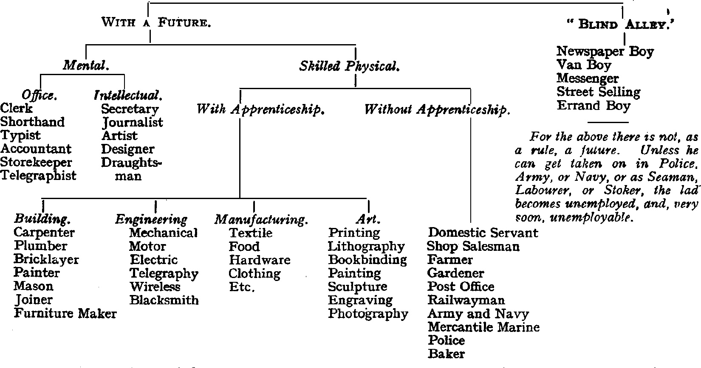

# IV. Making a Career

From a national point of view we have too many drones in our social hive, both amon our well-to-do classes and among the poor.

We are a comparatively small nation in numbers, and we need the services of every man of our race if we are to keep our place in teh heavy competition of trades and manufactures that is coming on around us. Yet there is a fearful waste of human material in Great Britain to-day. This is mainly due to ineffective training. The general mass of bosy are not taight to like work. Even when theya re taguth handicrafts or business qualities, they are not shown how to apply these to making a career, nor is the flame of ambition kindled in them. Where they happen to be square pegs they are too often placed in round holes. Whether it is the fault of the schoolmaster, or the parent, or the system of education, one cannot say, but the fact remains that it is so. Consequently, those boys who have not got these gifts naturally are allowed to drift and to become wasters. They are a misery to themselves and a burden—even in some cases, a danger—to the State. And the large proportion of those who do make some sort of a success would undoubtedly do better were they trained in a more practical way. In the Boy Scouts we can do something to remedy these evils. We can take some steps towards giving even the poorest boy a start and a chance in life equipped, at any rate, with hope and a handicraft.

*How?* Naturally one's thoughts run to handcraft Badges. Though we call these "Handicrafts," they are, with our standard of tests, little more than "Hobbies." This, however, is part of our policy of leading the boys on with small and easy beginnings; and these Hobbies become more specialised as vocational training for the Senior Scouts. In the meantime, hobbies have their value; through these the boy learns to use his fingers and his brain, and to take a pleasure in work. For one boy these may remain his hobbies for years; for another they may lead to craftsmanship which will give him a career. In either case, the boy is not so likely to become a waster later on. Hobbies are an antidote to Satan's little games.

But hobbies or handicrafts are not likely to make a career for a boy without the help of certain moral qualities. Thus, the craftsman must have self-discipline. He must adapt himself to the requirements of his employer and of his fellow-workers, he must keep himself sober, and efficient, and willing.

He must have energy, and that depends on the amount he has of ambition, of skill, of resourcefulness, and of good health.

Now, how do we apply these in the Boy Scout's training? The progressive steps by which you work up to them with the boys, begin on the right of the table.

| Qualities to be developed. | Attributes which they include. | Scout Law and badges which help them. | Scouting practices by which they are inculcated. |
|------|------|------|------|
| *(c)* **Self-Discipline.** | Obedience. Thrift. Sobriety. Good temper. Fortitude. | *Laws 2, 7, 8, 9, 10* | Scout law. Woodcraft lore and camp etiquette. Camp discipline. Ceremonial drill discipline. Dicipline of fire brigade, trek cart, boat, bridge-building drills. Savings bank. Non-smoking. Games requiring good temper, patience, and sticking to rules. |
|------|------|------|------|
| *(g)* **Energy** | Ambition. Health. Resourcefulness. Handicrafts. Cheeriness. | *Badges.* King's Scout. Sea Scout. Carpenter Plumber. Clerk. Cook. Printer. Mason. Basket-worker, etc. etc. | Camp resourcefulness, leading to Pioneering. Pioneering, leading to handicrafts. Health exercises (see Subject III.) Handicrafts. |

## The Scoutmaster's Share

So much for the lines on which a boy can be practically prepared through Scouting for making a career.

But this only prepares him. It is still in the power of his Scoutmaster to give him further help to making that career a successful one.

First, by showing the lad ways by which he can perfect the superficial instruction received as a Scout; whereby, for instance, he can develop his hobbies into handicrafts. The Scoutmaster can show him where to get higher technical education, how to get scholarships or apprenticeships, how to train himself for particular professions, how to invest his savings, how to apply for jobs, and so on.

Secondly, by himself knowing the different kinds of employment agencies and how to use them, the terms of service in various professions, the Scoutmaster can give the lad invaluable help, by advising him, on his knowledge of his qualifications, as to which line of life he is best fitted for. All this means that the Scoutmaster must himself look around and inform himself fully on these and like points. By taking a little trouble himself he can make successful lives for many of his boys.

All this means that the Scoutmaster must himself look round and inform himself fully on these and like points. By taking a little trouble himself he can make successful lives for many of his boys.

## The Necessary Qualities for Success

Mr. Gordon Selfridge has very kindly given me some ideas on training lads for careers in large business houses. He is a great believer in the saying of Robert Louis Stevenson: "To travel hopefully is a better thing to arrive, and the true success is to labour."

"One of the best things in this world is progress in the right direction."

One of the maxims which Mr. Selfridge impresses on his employees in this: "A man should always act as if he had a serious and clever competitor close behind him, so that he is continually putting forth his best efforts to keep the imaginary competitor from winning his place."

The guide book which Mr. Selfridge issues for the assistance of his employees shows how the following points, which we inculcate in the Boy Scouts, are of greatest value to a young fellow in getting on in his career in a big business house. *Strict adherance to instructions,* with the feeling that such obedience is "playing the game" for the good of the business.

*Energy* and making best use of the time available. "Waste of time where so many are employed is a very serious matter. If one hundred people waste only five minutes each day, the loss is more than eight hours, or a hundred days in a year."

*Courtesy*: "We would have the members of our staff courteous to one another." "Impress visitors or customers that they are welcome."

"It is attractive to customers to be served by assistance whose manners show happiness in what they are doing."

"Those who come merely to look, may become good customers if merchandise is shown them tactfully and cheerfully."

*Intelligence*: "An employee should not be content merely to know his own groove in the business, but should develop some general knowledge of its other branches, and so be able both to advise customers and to quality himself for higher posts."

*Neatness in dress and appearance*: "These go a long way to commending an applicant for employment or for promotion."

*Perseverance*: "In my opinion, two of the qualities which will undoubtedly carry one far along the path of success are *concentration* and *perseverance*.

"You cannot succeed by making an effort in fits and starts; on the contrary, a sustained and steady effort is necessary. Hence it comes about that the 'sticker' beats the merely clever man so often in the race of life."

Personally, I fully endorse these ideas, and if I were asked to sum up all in a single motto for guiding a boy to success in his profession, I should say—

> *"Stick to it, and make yourself indispensable."*

On that text, you can preach a very practical sermon and frame a useful training. It is encouraging to a lad, even if he is only an errand boy, to know that if he does his errands so well that his master feels he could not get a better boy, he is safely on the road to promotion. But he must stick to it, and not be led aside by fits and disinclination or annoyance; if he gives way to these he will never succeed. Patience and perseverance win the day. "Softly, softly catchee monkey."

## "Pioneering" as a First Step

The first step towards getting a Scout to take up handiwork is most easily effected in camp, in the practice of hut-building, tree-felling, bridge-building, improvising camp utensils, such as pot-hooks and plate-racks, etc., tent-making, mat-weaving with the camp-loom, and so on, as suggested in *Scouting for Boys*. The boys find these tasks to be practical and useful to their comfort in the camping season. After making a start on these, they will be the more keen to go in for such hobbies in the winter evenings, in the club, as will bring them badges in return for proficiency, and money in return for skilful work. In that way they soon grow into ardent, energetic workers.

I commend to your notice the practical suggestions on this head, given by Mr. Ben Wilde, in the *Scoutmaster's Training Course* (No. 2 Birmingham), on the subject of "Badges and How They Should be Won."

## Technical Training

The following extract from *Ye Handi-craft Booklet*, by Leader A. Pruden, of the Kent Street (London) Troop, gives a sample of what Scoutmasters can do in the direciton of hobby training, which may be suggestive.

In hints for helping a Scout to take up handicrafts the author writes—

"Let him first see the list of various hobbies for which Scout badges are granted, then let him carefully read in teh *Boy Scout Test Book*  all about the particular badges which most appeal to him. Having done this, it will not be difficult for him to decide which he will choose for his hobby."

"His Scoutmaster can probably put him in touch with some expert who will be pleased to help him forward. If he be fourteen years of age, in London, the County Council will let him join an evening class for his particular hobby, where will be unfolded to him soe of the secrets of his craft.

"Even when only thirteen years of age, if he is skilled in his hobby, if he has the sanction of his headmaster, and provided he is in the seventh standard, he can gain entrance to the London County Council Central School of Arts and Crafts, Southampton Row, for Silversmiths' Work and allied crafts, which include Silversmithing, Goldsmiths' and Jewellers' Work, Diamond Mounting and Gem Setting, Art Metal Work, Chasing, Repoussé Work, Engraving, Die Sinking, Designing, Modelling, Metal Casting, Enamelling, etc.; further, if only in the sixth standard, he is eligible to join the school and learn the craft of Book Production, Printing, Binding, etc. There are small fees to pay, but in cases where the parents are poor, these are reduced or remitted. Then there is the Westminster Technical Institute of Cookery, where he can be trained as a chef.

"At the age of sixteen, when he leaves, his Scoutmaster should have little difficulty in arranging a five years' apprenticeship for him with a business firm of standing, where, for the whole of the period he will be receiving a wage. During this five years he can meet with success on every hand; he can gain London County Council money scholarships at the evening classes he would still attend; his friends would recognise his skill, and in spare time he would be able to make saleable articles of artistic merit.

"At the age of twenty-one, when he arrives at man's estate, he should be able (according to his skill and talent) to secure a position at any figure between £100 and £300 per annum. It will thus be seen by every Scout who reads this booklet, that by the development of a hobby, he has the opportunity of laying the foundation for a successful and happy career."

## Employment

The Scoutmaster, knowing his boy's character, can best advise him and his parents as to what line to take up.

In the first place, he should discriminate between those employments which offer a future to the boy and those which lead to nothing (so-called "Blind-Alley jobs"). These latter often bring in good money for the time being, to increase the weekly income of the family, and are, therefore, adopted for the boy by the parents regardless of the fact that they give no opening to him for a man's career afterwards.

Those which promise a future need careful selection with regard to the lad's capabilities, and they can be prepared for, while he is yet a Scout. A skilled employment is essentially better than an unskilled one for the boy's future success in life.

## Employment Agencies

Employment agencies, and the means of getting suitable occupations for lads, differ according to localities, and the Scoutmaster, therefore, has to make himself acquanted with those prevailing in his neighbourhood.

But in many centres it is found, by experience, best for the Scout authorities to form their own employment agencies. They can then place their lads out in situations best suited to their respective individual characters, and this give them unusually good chances of getting on.

All this may, no doubt, give some little extra trouble to the Scoutmaster or to the Association, President, or Commissioner, but it is repaid by the consciousness that he has thereby been the means of staring the boy in life, with every prospect of success, where, in many a case, he would otherwise have drifted into a wasted existence.

Surely such result would in itself be a sufficient reward to most men.

## Industrial Ignorance

> I often wonder whether it is not possible for some business-headed Scoutmaster to introduce into his Troop work some form of co-operative manufacture or industry—say, for one instance, toy-making—in which each Patrol would have its definite share, and which should be organised and carried on in such a way as to give practical insight and experience of running an industrial concern, showing how increased output brings increased returns, etc.

Sir Lynden Macassey has lately pointed out in the *Times* that after conducting some 3000 industrial conferences, he is impressed with the fact that economic ignorance and fallacies among both employers and employed is largely responsible for the ruinous unress now prevalent.

Workmen seem unable to grasp the principle that security of employment, good "real" wages, reasonable hours, and fair conditions of employment can be assured only by production.

Employers generally have no conception of the demonstrable money value of treaing the man as entitled to a voice in regulating the conditions of his employment, nor of the definite mistake of treating him as an economic unit. Workmen tenaciously cling to the fallacy, long exploded in America, that restricted output relieves unemployment, enhances wages, and raises the status of labour.

Wrong ideas and fallacies are actually and deliberately taught to children to Socialist schools. False doctrine, heresy, and schism are definitely preached to workers by means of leaflets and addresses so that antagonism is the prevailing spirit. It is all based on wrong grounds. We don't, in the Scouts, want to join in the politics which somehow get mixed up with th economic question, which somehow get mixed up with the economic question, but we do want to educate the coming man as to where his best interests lie and how, in serving his country's commercial interests, he is also serving his own.

## Employment

## Programme For Study Patrol

C> **Subject IV. "Making a Career"**

| Theoretical Aim. | Instruction in Detail. |
|------|------|
| 5th Week.—*Ready obedience. Using wits and hands.* | Trek cart drill. Fire drill. Boat drill (rowing and sailing). |
|------|------|
| 6th Week.—*Good temper. Cheeriness. Keenness.* | Football and other team games (*e.g.* whale hunting), involving good temper, discipline, patience, sticking to the rules and playing for one's side and not for oneself. |
|------|------|
| 7th Week.—*Pioneering leading to hobbies. Resourcefulness.* | Use of axe. Camp expedients. Camp loom, Model bridge building. Improvising bridges, huts, tools, etc., out of materials available on the spot. |
|------|------|
| 8th Week.—*Hobbies leading to handicrafts. Exhibitions of articles made by Scouts.* | Working up for Badge Examination in the different crafts and trades in Technical or Evening Schools. How to apprentice boys. Use of Labour Bureaux and Employment Agencies. Conditions of service in Civil, Naval, Military, and Post Office, etc. |

## Week-end Camps

A trek cart to carry equipment. Cut your own wood for fires. Make your own bed with camp loom and other camp expedients. Camp fire yarns on theories. Practise details. Camp games.
