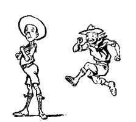
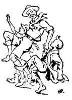

# IV. Service to Others

The attributed which we have so far been studying, as tending to make our boys into manly, healthy, happy working citizens, are, to a great extent, selfish ones designed for the good of the individual. We now come to the fourth branch of Scout training, through which, by developing his outlook, the boy gives out good to others.

## Selfishness

If I were asked what is the prevailing vice in the world I should say - Selfishness. You may not agree with this at first sight, but look into it and I believe you will come to the same conclusion. Most crimes, as recognised by law, come from the indulgence of selfishness, from a desire to acquire, to defeat, or to wreak vengeance. The average man will gladly give a contribution to feed the poor and will feel satisfied that he has then done his duty, but he is not going to dock himself of his own food and good wine to effect a saving for that purpose.

Selfishness exists in a thousand different ways. Take, for instance, party politics. Men here get to see a question, which obviously has two sides to it, exactly as if there were only one possible side, namely, their own, and they then get to hate another man who looks upon it from the other side. The result may lead men on to commit the greatest crimes under high-sounding names. In the same way, wars between nations have come about from neither party being able to see the other's point of view, being obsessed entirely by their own interests. Strikes, too, and lockouts are frequently the outcome of developed selfishness. In many cases, employers have failed to see that a hard-working man should, in justice, get a share of the goods of the world in return for his effort, and not be condemned to perpetual servitude simply to secure a certain margin of profits for the shareholders. On the other hand, the worker has to recognise that without capital there would be no work on a large scale, and there can be no capital without some return to the subscribers for the risks they face in subscribing.

In one's newspaper every day one sees examples of selfishness when one reads the letters of these small-minded men who, at every little grievance, rush headlong to

"write to the papers." And so it goes on, down to the children playing their games in the streets; the moment that one is dissatisfied at not getting his share of winning he abruptly leaves the scene remarking: "I shan't play any more!" The fact that he upsets the fun of the others does not appeal to him - unless it be satisfying to his spite.

## To Eradicate Selfishness - The Good Turn Habit

The Scouting practices tend in a practical way to educate the boy out of the groove of selfishness. Once he becomes charitable he is well on the way to overcome or to eradicate the danger of this habit.

The Promise that a Scout makes on joining has as its first point: "To do my duty to God." Note that it does not say "To be loyal to God," since this would merely be a state of mind, but to do something, which is the positive, active attitude.

The main method in the Boy Scout Movement is to give some form of positive training rather than merely to inculcate negative precepts, since the boy is always ready to do rather than to digest. Therefore, we put into his activities the practice of Good Turns in his daily life as a foundation of future goodwill and helpfulness to others. The religious basis underlying this is common to all denominations, and we, therefore, interfere with the form of none.

The boy can then realise better that part of his "Duty to God" is to take care of and develop as a sacred trust those talents with which God has equipped him for his passage through this life; the body with its health and strength and reproductive powers to be used in God's service; the mind with its wonderful reasoning, memory and appreciation, which place him above the animal world; and the soul, that bit of God which is within him - namely, Love, which can be developed and made stronger by continual expression and practice. Thus we teach him that to do his Duty to God means, not merely to lean on His kindness, but to do His will by practising love towards one's neighbour.

The curious thing is that this duty of Service for Others through Good Turns is the one to which Scouts rise with the fullest alacrity. On this seemingly small foundation (the giving up of small personal conveniences or pleasures in order to render service) is built the character of self-sacrifice for others. The minor Good Turns which are part of the Scout's faith are in themselves the first step. Nature study and making friends with animals increase the kindly feeling within him and overcome the trait of cruelty which is said to be inherent in every boy (although, personally, I am not sure that it is so general as is supposed). From these minor Good Turns he goes on to learn first aid and help to the injured, and in the natural sequence of learning how to save life in the case of accidents, he develops a sense of duty to others and a readiness to sacrifice himself in danger. This, again, leads up to the idea of sacrifice for others, for his home, and for his country, thereby leading to patriotism and loyalty of a higher type than that of merely ecstatic flag-waving.

## Service for the Community

The teaching of service is not merely a matter of teaching in theory, but the devel- opment of two distinct phases - the inculcation of the spirit of goodwill; and the provision of opportunity for its expression in practice.

The teaching is mainly through example, and the Scoutmaster gives exactly the right lead in his patriotic dedication of self to the service of the boy, solely for the joy of doing it, and without thought of material reward.

The opportunity for practice is given by the Scoutmaster suggesting to his boys special service projects.

Public services offer the best opening for practical training in sense of duty to the community, patriotism and self-sacrifice through expression.

The work of Scouts during peace and during wars in voluntarily taking up arduous duties in service of their country is in itself a proof of the keenness of the lads to do good work, and of their readiness to make themselves efficient where they see a good object. In this direction lies a powerful means of developing on practical lines the ideal of citizenship.

As one specific example of public service might be mentioned Boy Scout Acci- dent and Fire Service (Emergency Service) for towns and villages. Such service is especially applicable to Senior Scouts, and acts as an attractive force to the older boy while giving him public services to train for and to render.

The Troop is organised, equipped, and trained primarily for fire fighting, but with the further ability to deal with all kinds of accidents that, are possible in the neighbourhood, such, for instance, as: Street accidents; gas, chemical or other explosions; floods or inundations; electric accidents; railway accidents; fallen trees or buildings; ice accidents; bathing or boating accidents; airplane crashes; etc.

This would demand, in addition to the drill, rescue and first aid required for fire work, knowledge and practice in methods of extricating and rescuing, and rendering the proper first aid in each class of work; such as: Knowledge of gases and chemicals; handling of boats, improvising rafts, use of life line; use of lifebuoys, life saving in the water, artificial respiration; how to deal with frightened animals; how to deal with electric live wires, burning liquids; etc.

In some cases it may be best for each Patrol to specialise in a particular form of accident, but generally if the Patrols practise all in turn they arrive at complete efficiency for the whole Troop. Organisation for an accident would, however, confer specific duties on each Patrol, e.g., a Patrol of rescuers, first aiders, crowd holders, messengers, etc.

The variety of work to be done supplies a whole series of activities such as should appeal to the boys.

Frequent mobilizations to practise on improvised accidents are essential to at- taining efficiency and keenness.

As efficiency becomes evident public interest will be aroused probably to a helpful degree. The scheme will then be recognised as having a double value, an education for the boys, and a blessing for the community.

## Ulterior Effect

The repression of self and development of that love and service for others, which means God within, bring a total change of heart to the individual and with it the glow of true Heaven. It makes a different being of him.

The question becomes for him not "What can I get?", but "What can I give in life?"

No matter what may be his ultimate form of religion, the lad will have grasped for himself its fundamentals, and knowing these through practising them he becomes a citizen with a widened outlook of kindliness and sympathy for his brother men.
