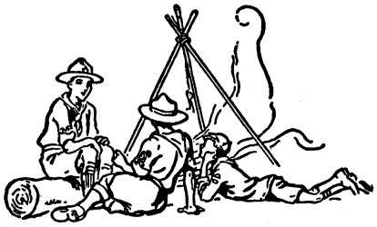
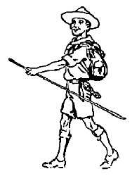
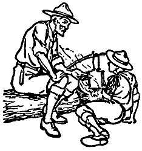

# The Boy

## The Nature of the Boy

The first step towards success in training your boy is to know something about boys in general and then about this boy in particular.

Dr. Saleeby, in an address to the Ethical Society in London, said:

> The first requisite for a successful teacher is knowledge of the nature of the boy. The boy or girl is not a small edition of a man or woman, not a piece of blank paper on which the teacher should write, but every child has his own peculiar curiosity, his inexperience, a normal mysteri- ous frame of mind which needs to be tactfully helped, encouraged and moulded or modified or even suppressed.

It is well to recall, so far as possible, what your ideas were when a boy yourself, and you can then much better understand his feelings and desires.

The following qualities in the boy have to be taken into consideration:

* Humour. - It must be remembered that a boy is naturally full of humour; it may be on the shallow side, but he can always appreciate a joke and see the funny side of things. And this at once gives the worker with boys a pleasant and bright side to his work and enables him to become the cheery companion, instead of the taskmaster, if he only joins in the fun of it.
* Courage. - The average boy generally manages to have pluck as well. He is not by nature a grumbler, though later on he may become one, when his self-respect has died out of him and when he has been much in the company of "grousers."
* Confidence. - A boy is generally supremely confident in his own powers. There- fore, he dislikes being treated as a child and being told to do things or how to do them. He would much rather try for himself, even though it may lead him into blunders, but it is just by making mistakes that a boy gains experience and makes his character.
* Sharpness. - A boy is generally as sharp as a needle. It is easy to train him in matters appertaining to observation and noticing things and deducing their meaning.
* Love of Excitement. - The town boy is generally more unsettled than his country brothers by the excitements of the town, whether they are "a passing fire engine, or a good fight between two of his neighbours." He cannot stick at a job for more than a month or two because he wants change.
* Responsiveness. - When a boy finds somebody who takes an interest in him he responds and follows where he is led, and it is here that hero-worship comes in as a great force for helping the Scoutmaster.
* Loyalty. - This is a feature in a boy's character that must inspire boundless hope. Boys are usually loyal friends to each other, and thus friendliness comes almost naturally to a boy. It is the one duty that he understands. He may appear selfish outwardly, but, as a general rule, he is very willing under the surface to be helpful to others, and that is where our Scout training finds good soil to work upon.

If one considers and studies these different attributes in the boy one is in a far better position for adapting the training to suit his different propensities. Such study is the first step to making a success of the training. I had the pleasure, during one single week, of coming across three boys in different centres who were pointed out to me as having been incorrigible young blackguards and hooligans until they came under the influence of Scouting. Their respective Scoutmasters had, in each case, found out the good points which underlay the bad ones in them, and having seized upon these had put the boys on to jobs which suited their peculiar temperaments; and there are now these three, fine hulking lads, each of them doing splendid work, entirely transformed in character from their old selves. It was worth the trouble of having organised the Troops just to have had these single successes.

Mr. Casson, writing in the magazine Teachers' World, thus describes that complicated work of understanding the Nature of the boy:-

> Judging from my own experience, I would say that boys have a world of their own - a world that they make for themselves; and neither the teacher nor the lessons are admitted to this world. A boy's world has its own events and standards and code and gossip and public opinion.
>
> 
>
> In spite of teachers and parents, boys remain loyal to their own world. They obey their own code, although it is quite a different code to the one that is taught to them at home and in the schoolroom. They gladly suffer martyrdom at the hands of uncomprehending adults, rather than be false to their own code.
>
> The code of the teacher, for instance, is in favour of silence and safety and decorum. The code of the boys is diametrically opposite. It is in favour of noise and risk and excitement.
>
> Fun, fighting, and feeding! These are the three indispensable elements of the boy's world. These are basic. They are what boys are in earnest about; and they are not associated with teachers nor schoolbooks.
>
> According to public opinion in Boydom, to sit for four hours a day at a desk indoors is a wretched waste of time and daylight. Did anyone ever know a boy - a normal healthy boy, who begged his father to buy him a desk? Or did anyone ever know a boy, who was running about outdoors, go and plead with his mother to be allowed to sit down in the drawing room?
>
> Certainly not. A boy is not a desk animal. He is not a sitting-down animal. Neither is he a pacifist nor a believer in safety first; nor a book-worm, nor a philosopher.
>
> He is a boy - God bless him - full to the brim of fun and fight and hunger and daring mischief and noise and observation and excitement. If he is not, he is abnormal.
>
> Let the battle go on between the code of the teachers and the code of the boys. The boys will win in the future as they have in the past. A few will surrender and win the scholarships, but the vast majority will persist in rebellion and grow up to be the ablest and noblest men in the nation.
>
> Is it not true, as a matter of history, that Edison, the inventor of a thousand patents, was sent home by his school teacher with a note saying he was 'too stupid to be taught'?
>
> Is it not true that both Newton and Darwin, founders of the scientific method, were both regarded as blockheads by their school teachers?
>
> Are there not hundreds of such instances, in which the duffer of the classroom became useful and eminent in later life? And doesn't this prove that our present methods fail in developing the aptitudes of boys?
>
> Is it not possible to treat boys as boys? Can we not adapt grammar and history and geography and arithmetic to the requirements of the boy's world? Can we not interpret our adult wisdom into the language of boyhood?
>
> Is not the boy right, after all, in maintaining his own code of justice and achievement and adventure?
>
> Is he not putting action before learning, as he ought to do? Is he not really an amazing little worker, doing things on his own, for lack of intelligent leadership?
>
> Would it not be vastly more to the point if the teachers were, for a time, to become the students and to study the marvelous boy-life which they are at present trying vainly to curb and repress?
>
> Why push against the stream, when the stream, after all, is running in the right direction?
>
> Is it not time for us to adapt our futile methods and to bring them into harmony with the facts? Why should we persist in saying dolefully, boys will be boys,' instead of rejoicing in the marvelous energy and courage and initiative of boyhood? And what task can be nobler and more congenial to a true teacher than to guide the wild forces of boy nature cheerily along into paths of social service?

## Environment and Temptations

As I have said, the first step to success is to know your boy, but the second step is to know his home. It is only when you know what his environment is when he is away from the Scouts that you can really tell what influences to bring to bear upon him.

Where the sympathy and support of the boy's parents are secured, where the parents have been brought into a mutual partnership with a fuller interest in the working of the Troop and the aim of the Movement, the task of the Scoutmaster becomes proportionately light.

Occasionally, in the home, there may be evil influences to overcome. In addition there are other temptations to the bad which the instructor of the boy must be ready to contend with. But, if he is forewarned, he can probably devise his methods so that the temptations fail to exercise an evil influence on his lads; and in that way their character is developed on the best lines.

One of the powerful temptations is that of motion pictures. Motion pictures have undoubtedly an enormous attraction for boys, and some people are constantly cudgelling their brains how to stop it. But it is one of those things which would be very difficult to stop even if it were altogether desirable. The point, rather, is how to utilise films to the best advantage for our ends. On the principle of meeting any difficulty by siding with it and edging it in one's own direction, we should endeavour to see what there is of value in motion pictures and should then utilise them for the purpose of training the boy. No doubt it can be a powerful instrument for evil by suggestion, if not properly supervised; but steps have been taken, and continue to be taken, to ensure a proper censorship. But, as it can be a power for evil, so it can just as well be made a power for good. There are excellent films now on natural history and nature study, which give a child a far better idea of the processes of nature than its own observation can do, and certainly far better than any amount of lessons on the subject.

History can be taught through the eye. There are dramas of the pathetic or heroic kind, and others of genuine fun, humour, and laughter. Many of them bring what is bad into condemnation and ridicule. There is no doubt that this teaching through the eye can be adapted so as to have a wonderfully good effect through the children's own inclination and interest in the "cinema palace." We have to remember too that motion pictures have the same influence on the schools which are now turning them to good account. In Scouting we cannot do this to the same extent, but we can utilise them as a spur to our own endeavours. We have to make our Scouting sufficiently attractive to attract the boy, no matter what other counter-attractions there may be.

Juvenile smoking and its detriment to health; gambling and all the dishonesty that it brings in its train; the evils of drink; of loafing with girls; uncleanness, etc., can only be corrected by the Scoutmaster who knows the usual environment of his lads. It cannot be done by forbidding or punishment, but by substituting something at least equally attractive but good in its effects.

Juvenile crime is not naturally born in the boy, but is largely due either to the spirit of adventure that is in him, to his own stupidity, or to his lack of discipline, according to the nature of the individual.

Natural lying is another very prevalent fault amongst lads; and, unfortunately, a prevailing disease all over the world. You meet it particularly amongst uncivilized tribes, as well as in the civilized countries. Truth speaking, and its consequent elevation of a man into being a reliable authority, makes all the difference in his character and in the character of the nation. Therefore, it is incumbent upon us to do all we can to raise the tone of honor and truth speaking amongst the lads.

## Troop Headquarters and Camp

The main antidote to a bad environment is naturally the substitution of a good one, and this is best done through the Troop Headquarters and the Scout Camp. By Headquarters I do not mean halfan-hour's drill once a week in a big schoolroom lent for the occasion - which has so often appeared to be the aim of those dealing with boys - but a real place which the boys feel is their own, even though it may be a cellar or an attic; some place to which they can resort every evening, if need be, and find congenial work and amusement, plenty of varied activity and a bright and happy atmosphere. If a Scoutmaster can only arrange this, he will have done a very good work in providing the right environment for some of his lads which will be the best antidote for the poison that otherwise would creep into their minds and characters.

What the Scoutmaster does, his boys will do. The Scoutmaster is reflected in his scouts. From the selfsacrifice and patriotism of their Scoutmaster, Scouts inherit the practice of voluntary self-sacrifice and patriotic service.

Then the camp (and this should be as frequent as possibly can be managed) is a still further and even more potent antidote than the Headquarters. The open and breezy atmosphere and the comradeship of continued association under canvas, in the field, and round the camp fire, breathes the very best of spirit amongst the lads, and gives the Scoutmaster a far better opportunity than any other of getting hold of his boys and of impressing his personality upon them.

## How to Catch Our Boys

I like to think of a man trying to get boys to come under good influence as a fisherman wishful to catch fish.

If a fisherman bait his hook with the kind Of food that he likes himself it is probable that he will not catch many - certainly not the shy, game kind of fish. He therefore uses as bait the food that the fish likes.

So with boys; if you try to preach to them what you consider elevating matter, you won't catch them. Any obvious "goody-goody" will scare away the more spirited among them, and those are the ones you want to get hold of. The only way is to hold out something that really attracts and interests them. And I think you will find that Scouting does this.

You can afterwards season it with what you want them to have.

To get a hold on your boys you must be their friend; but don't be in too great a hurry at first to gain this footing until they have got over their shyness of you. Mr. F. D. How, in his Book of the Child, sums up the right course in the following story:-

> A man whose daily walk led him down a certain dingy street saw a tiny boy with grimy face and badly-developed limbs playing with a banana- skin in the gutter. The man nodded to him - the boy shrank away in terror. Next day the man nodded again. The boy had decided there was nothing to be afraid of, and spat at the man. Next day the little fellow only stared. The day after he shouted ?Hi!' as the man went on. In time the little fellow smiled back at the greeting which he now began to expect. Finally, the triumph was complete when the boy - a tiny chap - was waiting at the corner and seized the man's fingers in his dirty little fist. It was a dismal street, but it became one of the very brightest spots in all that man's life.
