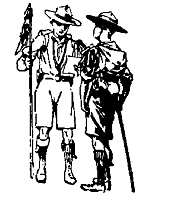

# The Patrol System

The Patrol System is the one essential feature in which Scout training differs from that of all other organisations, and where the System is properly applied, it is absolutely bound to bring success. It cannot help itself!

The formation of the boys into Patrols of from six to eight and training them as separate units each under its own responsible leader is the key to a good Troop.

The Patrol is the unit of Scouting always, whether for work or for play, for discipline or for duty.

An invaluable step in character training is to put responsibility on to the individual. This is immediately gained in appointing a Patrol Leader to responsible command of his Patrol. It is up to him to take hold of and to develop the qualities of each boy in his Patrol. It sounds a big order, but in practice it works.

Then, through emulation and competition between Patrols, you produce a Patrol spirit which is eminently satisfactory, since it raises the tone among the boys and develops a higher standard of efficiency all round. Each boy in the Patrol realises that he is in himself a responsible unit and that the honour of his group depends in some degree on his own ability in playing the game.

## Patrol Leaders' Council - Court of Honour

The Patrol Leaders' Council and Court of Honour is an important part of the Patrol System. It is a standing committee which, under the guidance of the Scoutmaster, settles the affairs of the Troop, both administrative and disciplinary. It develops in its members self-respect, ideals of freedom coupled with a sense of responsibility and respect for authority, while it gives practice in procedure such as is invaluable to the boys individually and collectively as future citizens.

The Patrol Leaders' Council takes charge of routine matters and the management of such affairs as Troop entertainments, sports, etc. In this Council it is often found convenient to admit the Seconds (Assistant Patrol Leaders) also as members, and, while getting their help, this incidentally gives them experience and practice in committee procedure. The Court of Honour, on the other hand, is composed solely of Patrol Leaders. The Court of Honour, as its name implies, has a rather exceptional mission, such as dealing with cases of discipline and questions of awards.

## Values of the Patrol System

It is important that the Scoutmaster recognise the extraordinary value which he can get out of the Patrol System. It is the best guarantee for permanent vitality and success for the Troop. It takes a great deal of minor routine work off the shoulders of the Scoutmaster.

But first and foremost: **The Patrol is the character school for the individual**. To the Patrol Leader it gives practise in Responsibility and in the qualities of Leadership. To the Scouts it gives subordination of self to the interests of the whole, the elements of self-denial and self-control involved in the team spirit of cooperation and good comradeship.

But to get first-class results from this system you have to give the boy leaders real free-handed responsibility - if you only give partial responsibility you will only get partial results. The main object is not so much saving the Scoutmaster trouble as to give responsibility to the boy, since this is the very best of all means for developing character.

The Scoutmaster who hopes for success must not only study what is written about the Patrol System and its methods, but must put into practice the suggestions he reads. It is the doing of things that is so important, and only by constant trial can experience be gained by his Patrol Leaders and Scouts. The more he gives them to do, the more will they respond, the more strength and character will they achieve.

## The Scout Uniform

I have often said, "I don't care a fig whether a Scout wears a uniform or not so long as his heart is in his work and he carries out the Scout Law." But the fact is that there is hardly a Scout who does not wear uniform if he can afford to buy it.

The spirit prompts him to it.

The same rule applies naturally to those who carry on the Scout Movement - the Scoutmasters and Commissioners; there is no obligation on them to wear uniform if they don't like it. At the same time, they have in their positions to think of others rather than of themselves.

Personally, I put on uniform, even if I have only a Patrol to inspect, because I am certain that it raises the moral tone of the boys. It heightens their estimation of their uniform when they see it is not beneath a grown man to wear it; it heightens their estimation of themselves when they find themselves taken seriously by men who also count it of importance to be in the same brotherhood with them.

Smartness in uniform and correctness in detail may seem a small matter, but has, its value in the development of self-respect, and means an immense deal to the reputation of the Movement among outsiders who judge by what they see.

It is largely a matter of example. Show me a slackly-dressed Troop and I can "Sherlock" a slacklydressed Scoutmaster. Think of it, when you are fitting on your uniform or putting that final saucy cock to your hat. You are the model to your boys and your smartness will reflect itself in them.

## The Scoutmaster's Share

The principles of Scouting are all in the right direction. The success in their application depends on the Scoutmaster and how he applies them. My present object is to endeavour to help the Scoutmaster in this particular: First, by showing the object of the Scout training; secondly, by suggesting methods by which it may be carried out.

Many a Scoutmaster would probably desire I should give him all particulars in detail. But this would in reality be an impossibility, because what suits one particular Troop or one kind of boy, in one kind of place, will not suit another within a mile of it, much less those scattered over the world and existing under totally different conditions. Yet one can give a certain amount of general suggestion, and Scoutmasters in applying this can judge for themselves far best which details are most likely to bring about success in their own particular Troops.

But before going into details, once more let me repeat: Do not be appalled by any imaginary magnitude of the task. It will disappear when once you see the aim. You have then only to keep that always before you and adapt the details to suit the end.

As in Peveril of the Peak: "It matters not much whether we actually achieve our highest ideals so be it that they are high."

Occasionally, difficulties may loom up so as almost to blot out the radiant possibilities. But it is comforting to remember that they are generally out of their proper proportion and subside as you approach them.
