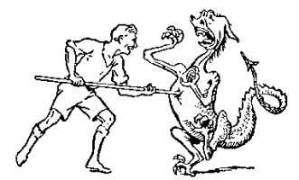
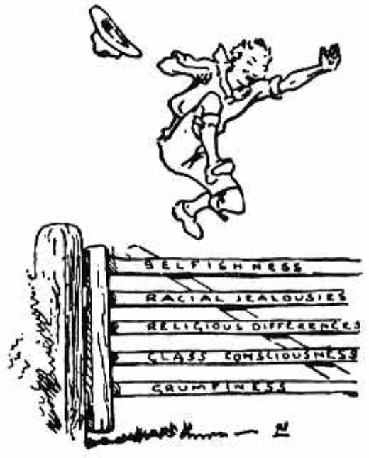

# To Sum Up

The whole object of our Scouting is to seize the boy's character in its redhot stage of enthusiasm, and to weld it into the right shape and to encourage and develop its individuality so that the boy may educate himself to become a good man and a valuable citizen for his country.

By so doing we may hope to take a useful part in bringing strength, both moral and physical, to the nation.

But in developing national aspirations there is always the danger of becoming narrow and jealous of other nations. Unless we avoid this we bring about the very evil we are anxious to escape.

Fortunately in the Scout Movement we have Brother Scouts organised in almost every civilised country in the world, and we have formed already the tangible nucleus of a World Brotherhood. And the potentialities of this are being supplemented by the wider development of the cooperative sister movement, the Girl Guides (Girl Scouts).

In every country the purpose of the Scouts' training is identical, namely, efficiency for Service towards others; and with such an object in common, we can, as an International Brotherhood in Service, go forward and do a far-reaching work.

In our training of the boy we develop the individual in both spirit and efficiency to be an effective player in his national team of citizenhood. Acting on the same principle in the case of a nation, we should try to develop the right spirit and efficiency for helping that nation to work effectively in the team of nations.

If each, then, plays in its place, and "plays the game," there will be greater prosperity and happiness throughout the world, there will be brought about at last that condition which has so long been looked for - of

C> **Peace and Goodwill among men.**

C> 

C> THE END
